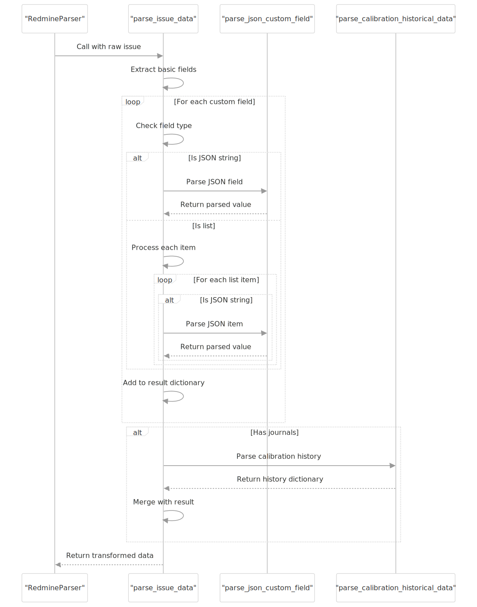

<a name="indexerd-md-top"></a>

<!-- TABLE OF CONTENTS -->

<details>
  <summary>Table of Contents</summary>
  <ol>
    <li><a href="#sobre-o-webrotas">Sobre o WebRotas</a></li>
    <li><a href="#requisitos-do-sistema">Requisitos do sistema</a></li>
    <li><a href="#instalação">Instalação</a></li>
    <li><a href="#uso-do-webrotas">Uso do WebRotas</a></li>
    <li><a href="#contribuindo">Contribuindo</a></li>
    <li><a href="#licença">Licença</a></li>
    <li><a href="#referências-adicionais">Referências adicionais</a></li>
</ol>
</details>

# App Overview

EquipData_Fiscaliza is an ETL (Extract, Transform, Load) tool designed to extract instrument and calibration data from Redmine, transform it into a structured format, and load it into Excel files for analysis and reporting. retrieve_data.py:4

## Features

- Extracts data from Redmine projects and issues
- Transforms complex data structures including JSON fields and historical records
- Processes calibration history from journal entries
- Organizes data into structured Excel sheets
- Handles both general register data and equipment-specific information

# Data Transformation Process

## Overview

The data transformation process converts raw Redmine issue data into structured DataFrames for two main categories:

1. General register data - containing instrument categories, types, brands, models, and accessories  
2. Equipment data - containing detailed information about specific instruments including calibration history


## Custom Field Parsing

The system handles a variety of custom fields from Redmine, including regular text values, JSON-encoded values, and multiple-value fields.

### JSON Custom Fields

Many fields in Redmine are stored in a JSON-like format. The `parse_json_custom_field` method processes these fields:

1. Attempts to parse as JSON
2. If parsing fails, applies string replacements to fix common format issues (e.g., `=>` to `:`)
3. Extracts the key value (typically found in the valor field)


Example raw custom field: `{'valor':'Medidor de Radiação não Ionizante','texto':'Medidor de Radiação não Ionizante'}`
After transformation: `Medidor de Radiação não Ionizante`

### Calibration History Transformation

One of the most complex transformations involves extracting historical calibration data from journal entries. This information is critical for tracking instrument maintenance over time.

The `parse_calibration_historical_data` method:

1. Iterates through journal entries for an issue
2. Looks for calibration date and certificate number fields
3. Creates year-specific keys for the data (e.g., "Data de calibração 2023", "Nº SEI Certificado calibração 2023")
4. Returns a dictionary with all historical calibration data



The system specifically looks for journal field IDs:

- `JOURNAL_CAL_DATE_ID` (ID: 581): For calibration dates [retrieve_data.py:52-53](src/retrieve_data.py#L52)
- `JOURNAL_CAL_CERT_SEI_ID` (ID: 583): For calibration certificate SEI numbers [retrieve_data.py:54-55](src/retrieve_data.py#L54)
  
### Issue Data Transformation

The main transformation function is `parse_issue_data`, which processes a raw Redmine issue and converts it into a structured dictionary:

1. Extracts basic issue attributes (ID, tracker, status, title)
2. Processes custom fields:
   - For list values, iterates through each item
   - For JSON values, calls parse_json_custom_field
   - Adds each field to the result dictionary with the field name as the key
3. For issues with journals, calls `parse_calibration_historical_data` to add historical calibration data
4. Returns a complete dictionary representing the transformed issue

The transformation process handles errors gracefully, logging warnings for issues with missing attributes without crashing.

(

### Data Structuring

After individual issues are transformed, they are structured into DataFrames:

1. General register issues are stored in `gr_df_dict`, a dictionary of DataFrames organized by tracker name

2. Equipment issues (with tracker ID 20) are stored in `instr_df`, a single DataFrame containing all equipment data [retrieve_data.py:50-51](src/retrieve_data.py#L50)

The transformation converts data from this hierarchical format:


```markdown
Project (e.g., "FISF-Instrumentos")  
└── Issues  
    ├── Issue #1   
    │   ├── Basic attributes (ID, tracker, status, title)  
    │   ├── Custom fields  
    │   └── Journals (containing calibration history)  
    ├── Issue #2  
    │   └── ...  
```

To this flattened, DataFrame format:

| ID    | Tipo (tracker) | Situação (status) | Título (subject)                  | Categoria do instrumento | Tipo de Instrumento | ... | Data de calibração 2023 | Nº SEI Certificado calibração 2023 |
|-------|----------------|-------------------|------------------------------------|--------------------------|---------------------|-----|-------------------------|-----------------------------------|
| 59323 | Instrumento    | Disponível        | Sensor de Potência - Rohde / NRT-Z44 | RF - Potência            | Sensor de Potência  | ... | 2023-05-15              | 53500.123456/2023-78              |

### Special Data Handling

The transformation process includes special handling for several types of data:

1. `Empty or null values`: Properly handled to avoid errors
2. `Historical data`: Structured to maintain chronological order
3. `JSON format errors`: The system applies fixes for common formatting issues
4. `Near-JSON format`: Special handling for values that are almost JSON but need conversion

For example, the system handles a special case where a custom field contains JSON-like data but uses Ruby-style syntax (`=>` instead of `:`):

```python
Original: {'numero'=>'53500.072890/2024-62', 'link_acesso'=>'https://sei.anatel.gov.br/sei/...'}  
Transformed: {'numero':'53500.072890/2024-62', 'link_acesso':'https://sei.anatel.gov.br/sei/...'}  
```

This handling ensures that even data with format inconsistencies can be properly transformed and included in the final Excel output.

### Transformation Workflow

The overall data transformation workflow involves two main processing paths:



The workflow consists of:

1. General Register Processing
   - Fetches issues from the "Cadastro-Instrumentos" project retrieve_data.py:44-45
   - For each issue, calls parse_issue_data
   - Adds the result to the appropriate DataFrame in gr_df_dict based on the tracker name

2. Equipment Data Processing
   - Fetches issues with tracker ID 20 from all relevant projects
   - For each issue, calls parse_issue_data
   - Adds the result to the instr_df DataFrame

This separation allows for different types of data to be processed independently while using the same transformation logic.

## Implementation

The data transformation is implemented in the `retrieve_data.py` script, which is part of the ETL process that extracts data from Redmine, transforms it, and loads it into Excel files.

The main workflow is executed in the `main()` function, which:

1. Initializes the user interface
2. Fetches projects from Redmine
3. Processes general register data
4. Processes equipment data
5. Saves the transformed data to an Excel file [retrieve_data.py:569-582](src/retrieve_data.py#L569-L582)

## Dependencies

The project relies on several Python libraries:

- python-redmine: For interacting with the Redmine API
- pandas: For data manipulation and DataFrame operations
- openpyxl: For Excel file generation
- coloredlogs: For enhanced logging uv.lock:52-56

<div align="right">
    <a href="#indexerd-md-top">
        
    </a>
</div>

## Installation

1. Clone the repository
2. Install dependencies using UV at the base folder of the project:

```bash
uv sync  
```

<div align="right">
    <a href="#indexerd-md-top">
        
    </a>
</div>

## Usage

Run the main script:

```bash
uv python src/retrieve_data.py  
```

The script will:

1. Prompt for Redmine credentials
2. Connect to the Redmine server
3. Extract data from relevant projects
4. Transform the data into structured formats
5. Save the results to an Excel file

<div align="right">
    <a href="#indexerd-md-top">
        
    </a>
</div>

## Project Structure

- src/: Source code
  - retrieve_data.py: Main ETL script
  - custom_fields.json: Mapping of custom field IDs to names
- data/: Data files
  - projects.json: Mapping of project names to IDs

<div align="right">
    <a href="#indexerd-md-top">
        
    </a>
</div>

<!-- LICENSE -->

# Licença

Distribuído sob a licença GNU General Public License (GPL), versão 3. Veja [`LICENSE.txt`](../../LICENSE).

Para informações adicionais, consulte [https://www.gnu.org/licenses/quick-guide-gplv3.html](https://www.gnu.org/licenses/quick-guide-gplv3.html)

Este modelo de licença foi selecionado com a ideia de permitir a colaboração de qualquer pessoa interessada nos projetos listados dentro deste grupo.

Está em linha com as diretrizes de Software Público Brasileiro, conforme publicado em: [https://softwarepublico.gov.br/social/articles/0004/5936/Manual_do_Ofertante_Temporario_04.10.2016.pdf](https://softwarepublico.gov.br/social/articles/0004/5936/Manual_do_Ofertante_Temporario_04.10.2016.pdf)

Material adicional pode ser encontrado em:

- [http://copyfree.org/policy/copyleft](http://copyfree.org/policy/copyleft)
- [https://opensource.stackexchange.com/questions/9805/can-i-license-my-project-with-an-open-source-license-but-disallow-commercial-use](https://opensource.stackexchange.com/questions/9805/can-i-license-my-project-with-an-open-source-license-but-disallow-commercial-use)
- [https://opensource.stackexchange.com/questions/21/whats-the-difference-between-permissive-and-copyleft-licenses/42#42](https://opensource.stackexchange.com/questions/21/whats-the-difference-between-permissive-and-copyleft-licenses/42#42)

<div align="right">
    <a href="#indexerd-md-top">
        
    </a>
</div>

<!-- NOTES -->

# Notes

- This README focuses primarily on the data transformation aspect of the EquipData_Fiscaliza system was AI generated by [DeepWiki](https://deepwiki.com/) with minimal editions.
- The installation and usage sections are based on standard practices for Python projects and the information available in the codebase.
- The project structure section reflects the files visible in the provided context.

<div align="right">
    <a href="#indexerd-md-top">
        
    </a>
</div>

<!-- REFERENCES -->

# Referências adicionais

- [UV Short Guide](https://www.saaspegasus.com/guides/uv-deep-dive/)
- [Podman Cheat Sheet](https://people.redhat.com/tmichett/do180/podman_basics.pdf)

<div align="right">
    <a href="#indexerd-md-top">
        
    </a>
</div>