<a name="indexerd-md-top"></a>

<!-- TABLE OF CONTENTS -->

<details>
  <summary>Table of Contents</summary>
  <ol>
    <li><a href="#about">About</a></li>
    <li><a href="#system-architecture">System Architecture</a></li>
      <ul>
        <li><a href="#high-level-system-overview">High-Level System Overview</a></li>
        <li><a href="#key-components">Key Components</a></li>
        <li><a href="#data-processing-flow">Data Processing Flow</a></li>
        <li><a href="#data-model">Data Model</a></li>
        <li><a href="#configuration">Configuration</a></li>
        <li><a href="#key-features">Key Features</a></li>
      </ul>
    <li><a href="#installation">Installation</a></li>
    <li><a href="#usage">Usage</a></li>
    <li><a href="#license">License</a></li>
    <li><a href="#notes">Notes</a></li>
    <li><a href="#Additional References">Additional Refefences</a></li>
</ol>
</details>

# About

EquipData_Fiscaliza is an ETL (Extract, Transform, Load) tool designed to extract instrument and calibration data from Redmine, transform it into a structured format, and load it into Excel files for analysis and reporting.

This page provides a high-level introduction to the EquipData_Fiscaliza repository, explaining its purpose, architecture, and key components. This system extracts instrument and calibration data from Redmine, processes it, and exports it to Excel files for analysis.

## Purpose and Scope

EquipData_Fiscaliza is a Python-based ETL (Extract, Transform, Load) tool designed to:

1. Extract instrument and calibration data from a Redmine instance
2. Process and transform the data into structured formats
3. Export the data to Excel files for further analysis

The system focuses specifically on two primary data categories:

- General register data (instrument types, models, accessories)
- Equipment inventory data (including calibration history)
  
Se the detailed guides below for [Installation](#installation) and [Usage](#usage).

<div align="right">
    <a href="#indexerd-md-top">
        
    </a>
</div>

# System Architecture

## High-Level System Overview



<div align="right">
    <a href="#indexerd-md-top">
        
    </a>
</div>

## Key Components

The system consists of two main classes:

1. `uiTerminal` - Handles user interface interactions through a command-line interface:
   - Collects user credentials (username/password)
   - Displays formatted messages and titles
   - Handles user prompts and confirmations
   - Configures and manages system logging

2. `RedmineParser` - Core ETL engine responsible for:
   - Connecting to the Redmine server using provided credentials
   - Fetching and filtering projects and issues
   - Parsing general register and equipment data
   - Extracting historical calibration information
   - Transforming data into structured formats
   - Exporting data to Excel files

<div align="right">
    <a href="#indexerd-md-top">
        
    </a>
</div>

## Data Processing Flow


<div align="right">
    <a href="#indexerd-md-top">
        
    </a>
</div>


## Data Model
 

<div align="right">
    <a href="#indexerd-md-top">
        
    </a>
</div>

## Configuration

Configuration
The system uses several configuration variables to control its behavior:

| Configuration Variable      | Description                                   | Default Value                                      |
|-----------------------------|-----------------------------------------------|--------------------------------------------------|
| REDMINE_URL                 | URL of the Redmine server                    | "https://sistemas.anatel.gov.br/fiscaliza"       |
| PRJ_INSTR_GENERAL_REGISTER  | Name of general register project             | "Cadastro-Instrumentos"                          |
| PROJECT_NAME_KEYWORD        | Keyword to filter equipment projects         | "Instrumentos"                                   |
| GR_ISSUE_TRACKER_NAMES      | Tracker names for general register issues    | ["Categoria de instrumento", "Tipo de instrumento", "Marca e Modelo", "Tipo de Acessório"] |
| EQUIPMENT_TRACKER_ID        | Tracker ID for equipment issues              | 20                                               |
| JOURNAL_CAL_DATE_ID         | Journal field ID for calibration date        | "581"                                            |
| JOURNAL_CAL_CERT_SEI_ID     | Journal field ID for calibration certificate SEI | "583"                                        |
| OUTPUT_FILENAME_SUFFIX      | Suffix for output Excel filename             | "instrumentos_anatel"                            |
| OUTPUT_PATH                 | Path to save output files                    | User's home directory                            |

<div align="right">
    <a href="#indexerd-md-top">
        
    </a>
</div>

## Key Features

1. Targeted Data Extraction: The system extracts data from two primary sources:
   - General register project (Cadastro-Instrumentos)
   - Equipment projects (containing "Instrumentos" in the name)
2. Historical Data Processing: The system extracts historical calibration data from Redmine journal entries, providing a temporal dimension to instrument data.
3. Custom Field Handling: Implements specialized parsing for JSON-formatted custom fields.
4. Structured Data Organization: Exports data to an Excel file with multiple sheets:
   - Separate sheets for different general register trackers
   - A dedicated sheet for equipment data
   - Additional sheets for project metadata and custom field codes

<div align="right">
    <a href="#indexerd-md-top">
        
    </a>
</div>

# Installation

1. Clone the repository. Core compoenentes are:
   - src/: Source code
     - `retrieve_data.py`: ETL script single file
   - data/: Data files
     - Include examples in JSON format and images used in the documentation
2. Install dependencies using UV at the base folder of the project:

```bash
uv sync  
```

Core dependencies include:
- python-redmine: For interacting with the Redmine API
- pandas: For data manipulation and DataFrame operations
- openpyxl: For Excel file generation
- coloredlogs: For enhanced logging [uv.lock:52-56](.\uv.lock#L52-L56)

<div align="right">
    <a href="#indexerd-md-top">
        
    </a>
</div>

# Usage

Run the main script:

```bash
uv python src/retrieve_data.py  
```

The script will:

1. Prompt for Redmine credentials
2. Connect to the Redmine server
3. Extract data from relevant projects
4. Transform the data into structured formats (dictionaries and DataFrames)
5. Save the results to an Excel file

<div align="right">
    <a href="#indexerd-md-top">
        
    </a>
</div>

<!-- LICENSE -->

# License

Distributed under the GNU General Public License (GPL), version 3. See [`LICENSE.txt`](../../LICENSE).

For additional information, refer to [https://www.gnu.org/licenses/quick-guide-gplv3.html](https://www.gnu.org/licenses/quick-guide-gplv3.html).

This license model was chosen with the intent of enabling collaboration from anyone interested in the projects listed within this group.

It aligns with the Brazilian Public Software guidelines, as published in: [https://softwarepublico.gov.br/social/articles/0004/5936/Manual_do_Ofertante_Temporario_04.10.2016.pdf](https://softwarepublico.gov.br/social/articles/0004/5936/Manual_do_Ofertante_Temporario_04.10.2016.pdf).

Additional material can be found at:

- [http://copyfree.org/policy/copyleft](http://copyfree.org/policy/copyleft)
- [https://opensource.stackexchange.com/questions/9805/can-i-license-my-project-with-an-open-source-license-but-disallow-commercial-use](https://opensource.stackexchange.com/questions/9805/can-i-license-my-project-with-an-open-source-license-but-disallow-commercial-use)
- [https://opensource.stackexchange.com/questions/21/whats-the-difference-between-permissive-and-copyleft-licenses/42#42](https://opensource.stackexchange.com/questions/21/whats-the-difference-between-permissive-and-copyleft-licenses/42#42)

<div align="right">
    <a href="#indexerd-md-top">
        
    </a>
</div>

<!-- NOTES -->

# Notes

- This README focuses primarily on the data transformation aspect of the EquipData_Fiscaliza system was AI generated by [DeepWiki](https://deepwiki.com/) with minimal editions.
- The installation and usage sections are based on standard practices for Python projects and the information available in the codebase.
- The project structure section reflects the files visible in the provided context.

<div align="right">
    <a href="#indexerd-md-top">
        
    </a>
</div>

<!-- REFERENCES -->

# Additional References

- [UV Short Guide](https://www.saaspegasus.com/guides/uv-deep-dive/)

<div align="right">
    <a href="#indexerd-md-top">
        
    </a>
</div>